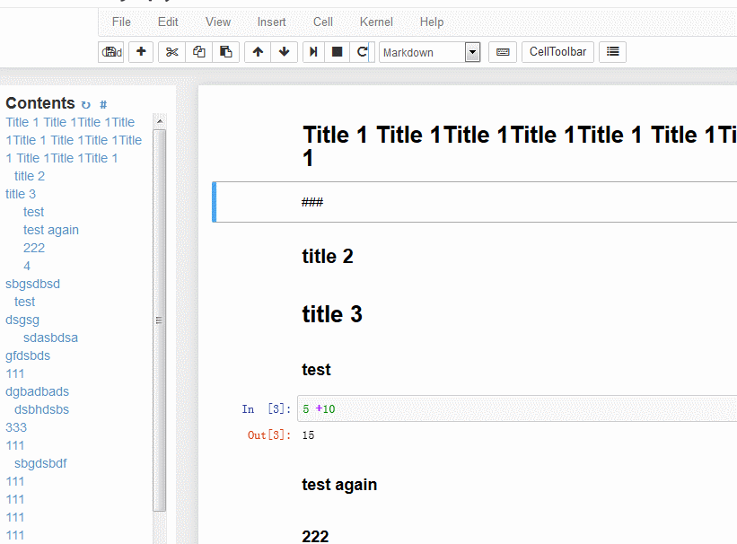

# Sidepyter

The missing sidebar table of contents for Jupyter Notebook (IPython Notebook),

based on toc2 at https://github.com/ipython-contrib/IPython-notebook-extensions

## How it looks

## Install

1. Download the `lib` dir

2. At the top of your notebook,

        from lib.lib_loader import sidebar
        sidebar()

3. Sidebar is loaded!

You can check the demo at `sidepyter_demo.ipynb`

## Features

1. Sidebar table of content at Jupyter Notebook Edit mode.

2. Outputable to HTML format
